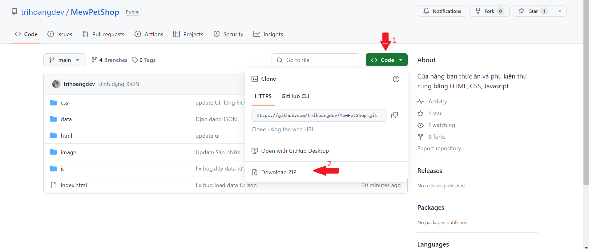
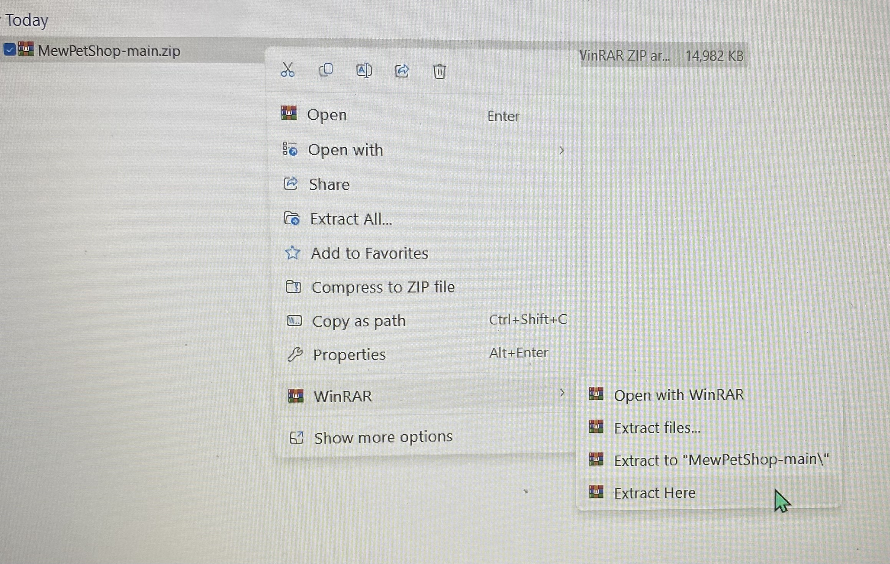
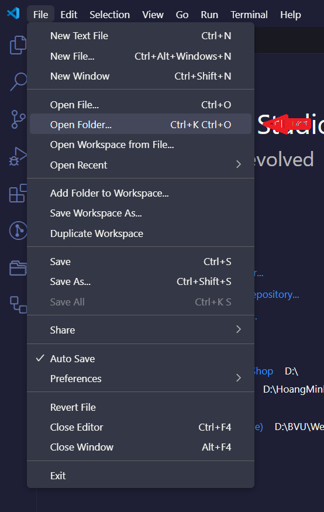
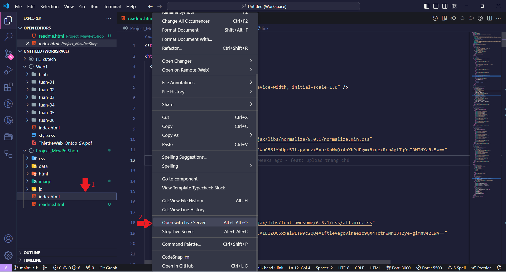

<!DOCTYPE html>
<html lang="en">
  <head>
    <meta charset="UTF-8" />
    <meta name="viewport" content="width=device-width, initial-scale=1.0" />
  </head>
  <body>
    <h1>Hướng dẫn cài đặt</h1>
    
<b>Bước 1:</b> Tải file từ github

    
    
<b>Bước 2: </b>Giải nén thư mục

    <ol>
      <li>Chuột phải vào file vừa chọn</li>
      <li>Chọn Winrar (hoặc phần mềm giải nén tương ứng)</li>
      <li>Chọn "Exact Here"</li>
      
    </ol>
    

      <b>Bước 3: </b>Mở Visual Studio Code, chọn File -> Open Folder -> Tìm đến
      file vừa tải
    

    
    

      <b>Bước 4: </b>Nhấp chọn file index.html -> Chuột phải -> Open with Live
      Server
    

    
    
<b>Bước 5: </b>Tận hưởng!!!

  </body>
</html>
